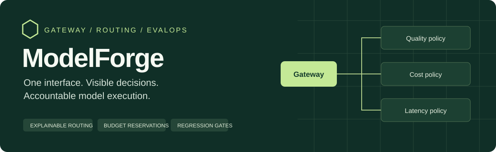
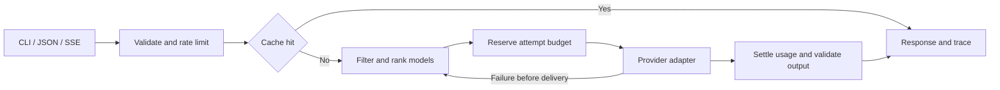

<p align="center">
  
</p>

<p align="center">
  <a href="https://github.com/mohanvamsikrishna-y/modelforge/actions/workflows/ci.yml"></a>
  
  
</p>

# ModelForge

**A provider-neutral LLM gateway with explainable routing and evaluation gates.**

ModelForge puts routing, failure recovery, and usage accounting behind one interface. Applications submit a task and a budget. The gateway ranks eligible models, streams the response, validates structured output, and returns a trace of its decisions.

[Quickstart](#quickstart) · [Architecture](docs/architecture.md) · [Demo walkthrough](docs/demo.md) · [API reference](docs/api.md) · [Implementation status](docs/status.md)

## What makes the design useful

| Engineering concern | ModelForge behavior | Evidence |
| --- | --- | --- |
| A timeout may still incur a charge | Unknown usage keeps its reservation; fallback needs additional allowance | [Budget and cancellation tests](tests/test_gateway.py) |
| A provider fails during streaming | Failover stops after the first delivered text delta | [Partial-stream test](tests/test_gateway.py) |
| Structured output is malformed | JSON is validated before delivery; failed attempts still count toward usage | [Schema and accounting tests](tests/test_gateway.py) |
| A model becomes unhealthy | Retries are bounded; a circuit suppresses calls until a recovery probe | [Circuit recovery test](tests/test_gateway.py) |
| Provider protocols differ | Four native adapters normalize streaming text, usage, and errors | [Adapter contract tests](tests/test_providers.py) |
| Evaluation results regress | A committed baseline gates quality, cost, latency, and dataset identity | [Regression-gate tests](tests/test_evaluation.py) |

## Quickstart

Requires Python 3.10 or newer. The default demo needs no API keys, package installation, or network access.

```sh
git clone https://github.com/mohanvamsikrishna-y/modelforge.git
cd modelforge
python3 -m modelforge demo
```

Open `runs/demo/report.html` to inspect seven routing and failure scenarios. Expand a scenario to see the candidate ranking, reservations, retries, and final result.

```sh
python3 -m unittest discover -s tests -v
python3 -m modelforge eval
```

**Verification scope** · 39 tests cover gateway behavior, native adapter contracts, localhost JSON/SSE endpoints, and regression comparisons. Six scripted cases exercise the evaluation pipeline. GitHub Actions runs the checks on Python 3.10, 3.12, and 3.13.

The offline providers return deterministic fixtures. Their prices and quality scores are illustrative. Live adapters for OpenAI, Anthropic, Gemini, and Ollama are implemented with mocked protocol tests; live provider calls are not part of the included evidence.

## Follow a request



Quality, cost, latency, and balanced policies use task-specific quality priors, configured latency, estimated cost, and current circuit state. Plain text streams incrementally. Structured JSON is buffered until it passes local validation.

The [architecture notes](docs/architecture.md) explain the scoring formula, reservation lifecycle, recovery behavior, cache boundaries, and production tradeoffs.

## Inspect the evidence

| Artifact | What to inspect |
| --- | --- |
| [Guided demo](docs/demo.md) | Seven reproducible scenarios and an outage trace |
| [Saved run JSON](docs/sample-run/report.json) | Requests, route decisions, attempt accounting, and results |
| [Saved evaluation](docs/sample-run/evaluation.json) | Per-case outcomes and aggregate metrics |
| [HTML report](docs/sample-run/report.html) | Download and open locally for expandable traces |
| [Dataset and baseline](modelforge/evals/) | Versioned cases and explicit regression thresholds |
| [CI workflow](.github/workflows/ci.yml) | Tests, evaluation gate, and downloadable run artifacts |

## Call the gateway

```sh
python3 -m modelforge serve
```

Send a streaming request from a second terminal.

```sh
curl -N http://127.0.0.1:8787/v1/stream \
  -H 'Content-Type: application/json' \
  -d '{"prompt":"Explain a circuit breaker.","policy":"quality"}'
```

Use `/v1/complete` for a single JSON result. The [API reference](docs/api.md) documents request fields, event types, error behavior, and the local service boundary.

For live calls, configure model names, current rates, and environment credentials using the [live provider guide](docs/live-providers.md). An optional separate live judge can score correctness, relevance, and coverage.

## Scope and next steps

This is a single-user reference implementation. State is process-local, budget estimates are not billing guarantees, and the HTTP server is intended for local use. The evaluation suite uses required terms, lexical F1, and schema checks. It does not measure semantic equivalence or establish model quality at scale.

The next engineering priorities are durable usage accounting, provider-aware token counting, concurrent admission control, representative live evaluations, and calibrated routing profiles. See the [full status matrix](docs/status.md) for implemented features and limits.

[Contributing](CONTRIBUTING.md) · [Protocol references](docs/sources.md)
